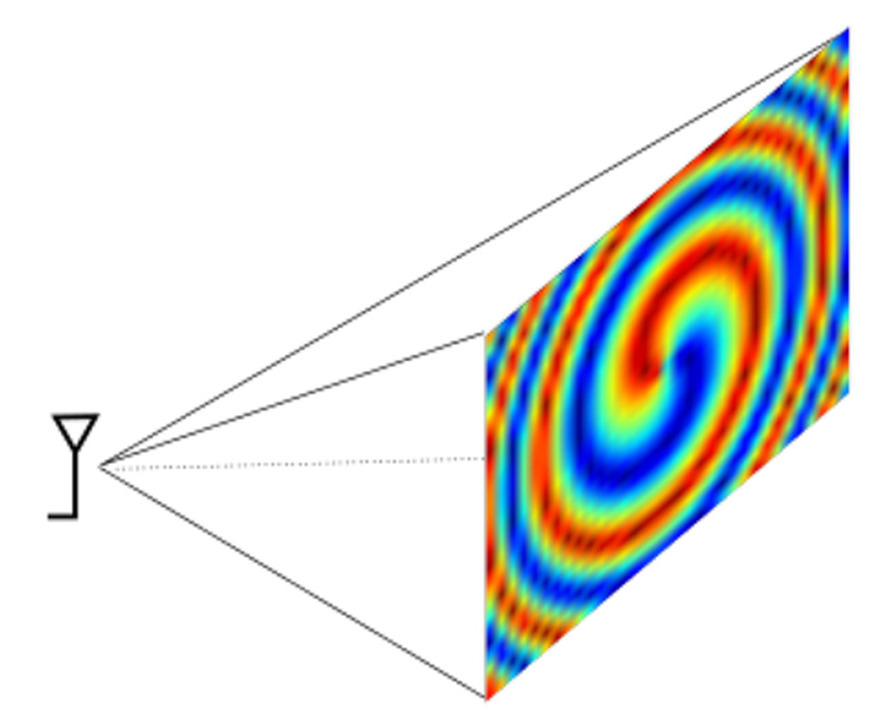
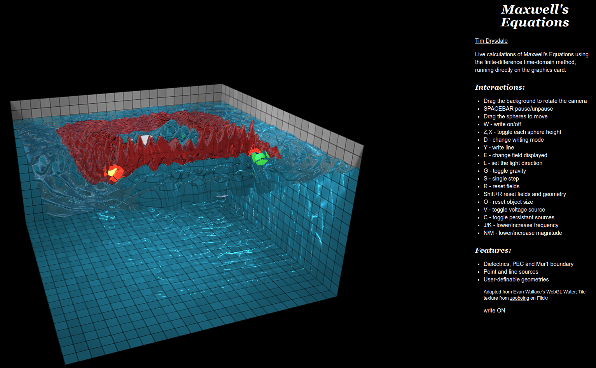

# maths-in-use
Selected examples of use of mathematics in my work

## Background

Academic staff have been asked to provide examples of mathematics usage in their research. The following topics are taught in our mathematics courses for engineers:

Engineering mathematics 1A:
1. Functions (including: graphing, parametric, one-to-one, inverse, solving polynomial equations, etc)
2. Solving Inequalities
3. Partial Fractions
4. Special Functions (trigonometric, exponential, hyperbolic, logarithmic)
5. Complex Numbers
6. Vectors
7. Matrices (including: solution by Gaussian elimination, eigenvalues and eigenvectors, etc)

Engineering mathematics 1B:
1. Infinite Sequences and Series (including: power series, etc)
2. Differentiation (including: chain, product and quotient rules, parametric differentiation, implicit differentiation, tangents and normals, maxima and minima)
3. Integration (including: definite and indefinite, integration by parts, integration by substitution, using partial fractions, applications of integration)

Engineering mathematics 2A:
1. Linear ordinary differential equations
2. Laplace transform and its use to solve linear differential equations
3. Fourier series analysis
4. Introduction to Partial Differential Equations with a focus on the wave equation

## Examples

### Complex numbers

I use complex numbers to keep track of the phase of electromagnetic fields radiated from antennas into free space. Since the antennas usually comprise multiple sources, these create interference patterns. Some of the more interesting patterns involve spiralling phase, in a type of radio mode called an Orbital Angular Momentum mode. I wrote an introductory tutorial on them which can be found [here](https://ietresearch.onlinelibrary.wiley.com/doi/10.1049/iet-map.2017.0293). An example of the calculated phase pattern resulting from an antenna with multiple sources is shown below for an OAM mode (individual sources not shown in the diagram):

Some code I use for making these calculations is [here](https://github.com/timdrysdale/pyoam)

### Wave equation

The wave equation is useful for calculating the movement of waves of different types. For electromagnetic waves, the physics can be less complicated than for water waves, because they are usually linear (unless you are doing high power laser physics or using semiconductors). I use a technique called Finite Difference Time Domain - this discretises a coupled pair of Maxwell's Equations (Faraday's law, and Ampere's law), to give a general calculation capable of handling free space and materials. An interactive example is [here](https://edlab1.eng.ed.ac.uk/fdtd/) with details in [this paper](https://ieeexplore.ieee.org/document/8087726). The code is [here](https://github.com/timdrysdale/webgl-fdtd).

